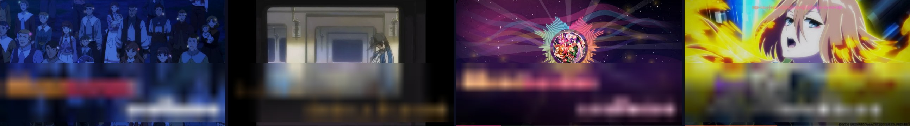
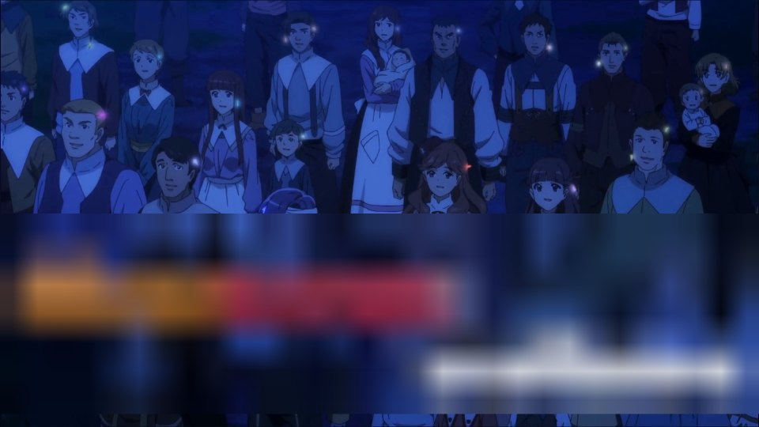
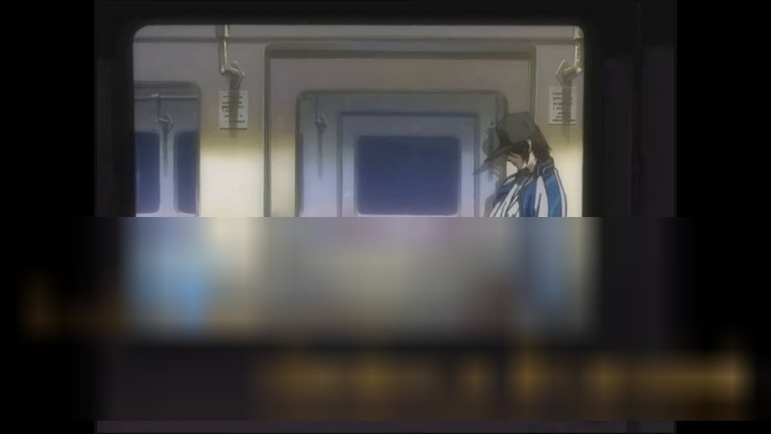
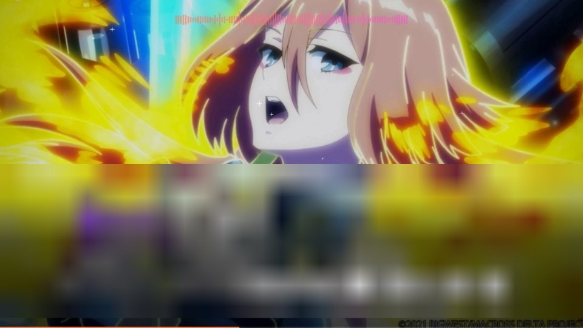
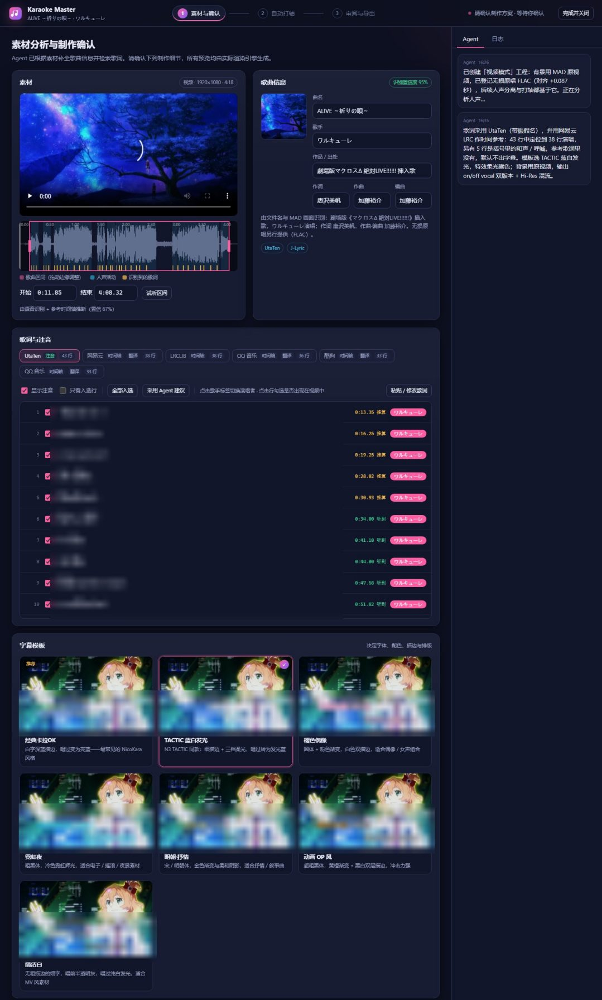
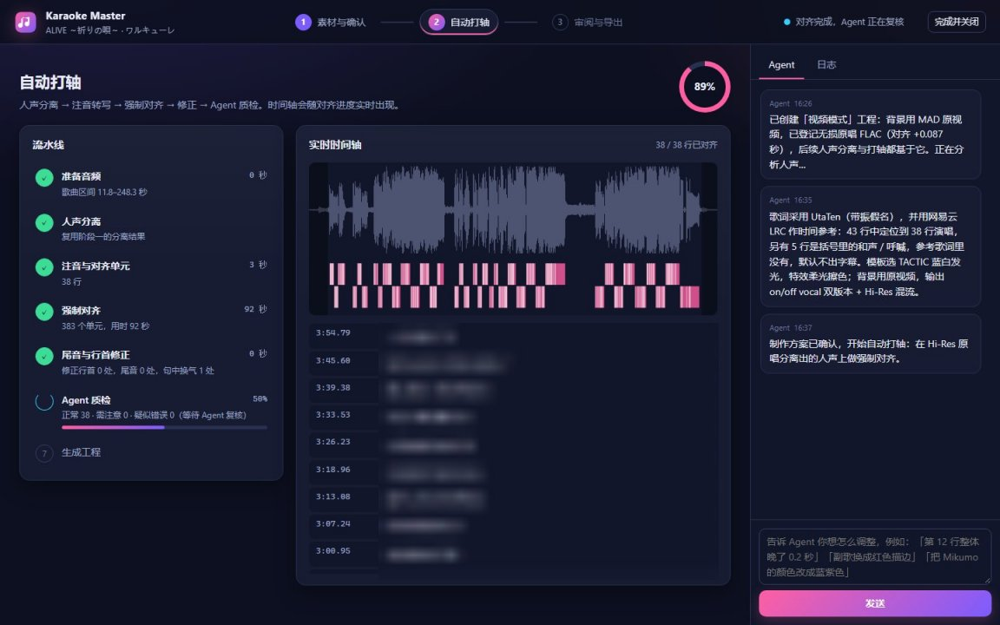
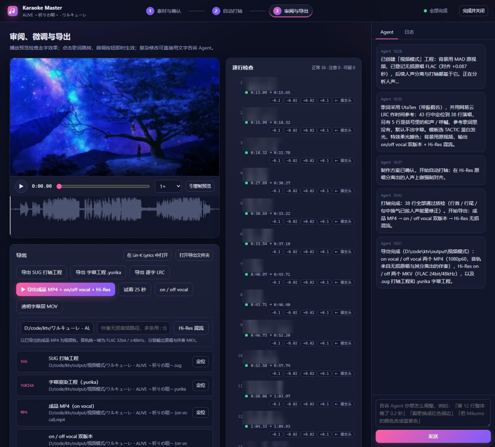
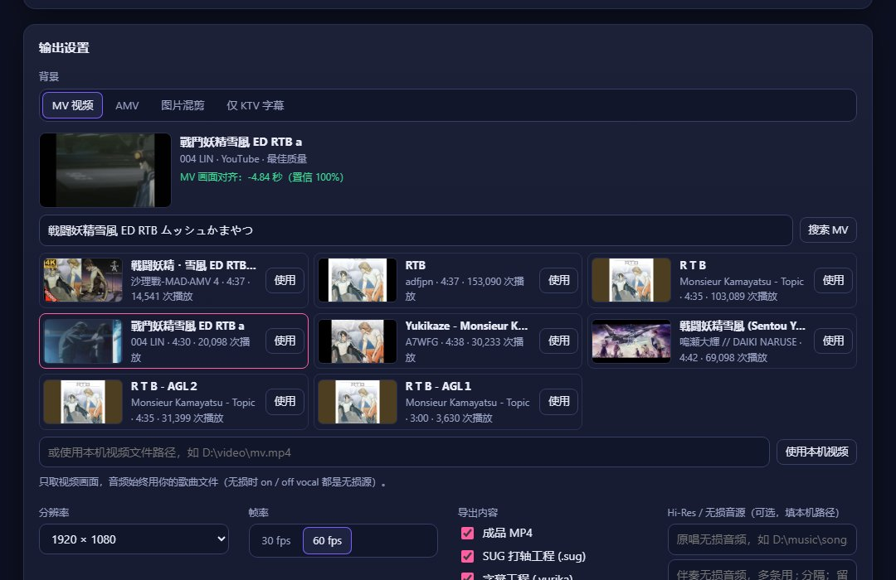
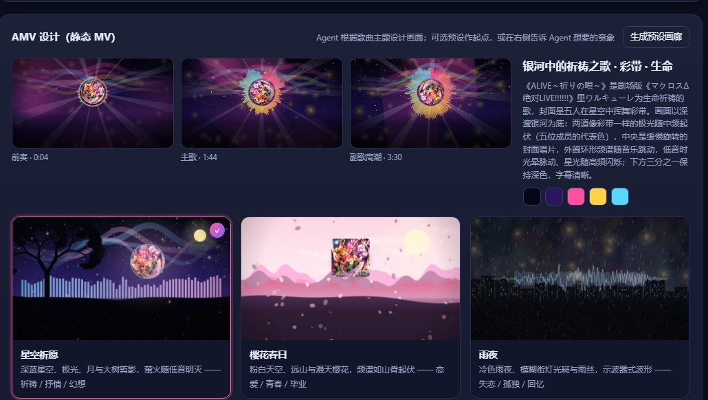
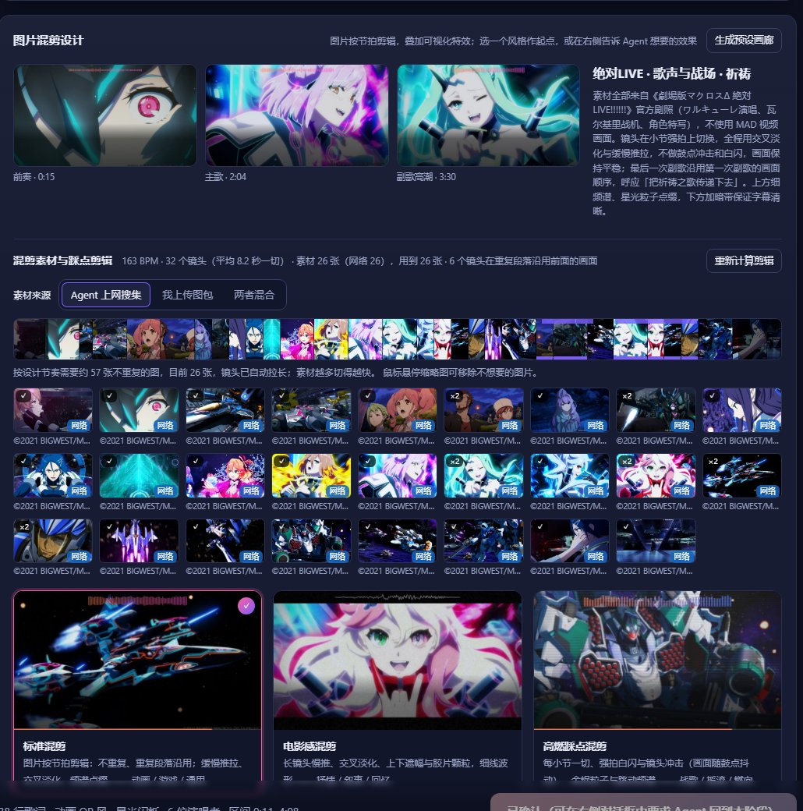

<div align="center">

# Karaoke Master · 卡拉OK制作 Agent Skill

**给 AI Agent 用的 KTV 字幕视频制作技能**：交给它一首歌名、一段音频或一个 MV / MAD 视频，
它会在本机打开一个专属于这个工程的网页，带你走完「素材确认 → 自动打轴 → 审阅导出」三个阶段，
最后交出逐字走字的卡拉OK 成品视频（on vocal / off vocal 双版本，可选 Hi-Res 无损混流）和可继续精修的工程文件。

[](LICENSE)




<sub>样例成品画面（左起：原视频 / 网络下载的 MV / AMV 频谱 / 图片混剪）。为避免转载歌词，文档中所有图片的歌词均已模糊处理。</sub>

</div>

---

## 它能做什么

| 你给 Agent 的 | 它交还给你的 |
|---|---|
| 歌名 / 音频文件 / 视频（MV、MAD、切片） | 逐字走字的卡拉OK MP4（30 / 60 fps，1080p 起，按歌割り给每位歌手上色） |
| 可选：无损原唱 FLAC（Hi-Res 音源） | **on vocal** 与 **off vocal**（伴奏）两个版本，伴奏由人声分离自动生成 |
| 可选：你自己的图包 | Hi-Res 混流 MKV（FLAC 32bit 无损原唱 / 伴奏轨） |
| 一句话的修改意见 | `.sug` 打轴工程、`.yurika` 字幕工程，可在 Lin-K Lyrics 桌面版里继续精修 |
| | 透明字幕层 MOV（ProRes 4444，叠加到 PR / AE / 达芬奇） |
| | 投屏延迟补偿：导出时画面比声音提前（默认 +200 ms，可调） |

Agent 自己完成：识别歌曲（作词 / 作曲 / 演唱者）、检索带振假名的歌词与参考时间轴、判断视频里实际唱了哪几句、
人声分离、强制对齐打轴、质检修正、按歌曲主题设计 MV 画面、按节拍剪辑图片……你只需要在网页里确认和提意见。

## 四种背景，四种成品

<table>
<tr>
<td width="25%"></td>
<td width="25%"></td>
<td width="25%"></td>
<td width="25%"></td>
</tr>
<tr>
<td><b>视频</b><br>直接用素材视频作背景；登记无损原唱后，打轴、伴奏分离与 Hi-Res 混流都基于无损音源。</td>
<td><b>网络 MV</b><br>只有歌曲文件时，Agent 用 Lin-K Lyrics 的下载模块（yt-dlp）从 YouTube / B 站找来这首歌的 MV 或动画 OP·ED，自动按波形对齐到你的音频，只取画面。</td>
<td><b>AMV（频谱可视化）</b><br>只有音频时，Agent 读懂歌曲主题后设计一套画面：配色、意象、封面唱片、环形频谱、粒子与光效，随低 / 中 / 高频律动。</td>
<td><b>图片混剪</b><br>官方宣传图 / 你的图包 / 两者混合，按检测到的节拍在小节强拍上切换；除重复段落外不重复用图；默认交叉淡化 + 缓慢推拉，画面平稳（想要燃向的鼓点冲击可以让 Agent 打开）。</td>
</tr>
</table>

另有 **仅 KTV 字幕** 模式：纯色底（黑底 / 绿幕）+ 透明字幕层 MOV，方便叠加到你自己剪的视频里。

## 三阶段网页

每个 KTV 工程都是一个独立文件夹，并有自己的本地网页（类似 [ppt-master](https://github.com/hugohe3/ppt-master) 的工程 + 实时预览页）。
网页和 Agent 只通过工程文件夹通信：你在网页上的每个操作都会交给 Agent，Agent 的进度实时显示在网页上；任务全部结束后，点右上角「完成并关闭」或由 Agent 关闭网页服务。

### ① 素材分析与制作确认



- 歌曲信息由 Agent 联网补全，歌词优先采用 UtaTen（带振假名），网易云 / QQ / 酷狗 / LRCLIB 的 LRC 作时间参考；
- 语音识别 + 参考时间轴推断视频里实际唱了哪些句子（MAD 剪掉的段落、括号里的和声会被标出）；
- 字幕模板、特效、多人合唱配色全部由**真实渲染引擎**在你的素材上出图，不是示意图；
- 背景（视频 / AMV / 图片混剪 / 仅 KTV 字幕）、帧率（30 / 60）、导出内容、Hi-Res 无损音源都在这里确定。

### ② 自动打轴



人声分离（UVR-MDX-NET）→ 注音转写 → 强制对齐（按间奏切块，避免误差漂移）→ 行首 / 行尾 / 句中换气修正 → Agent 质检复核。时间轴随对齐进度实时出现。

### ③ 审阅、微调与导出



网页预览与渲染引擎逐像素一致；逐行 ±0.02 / 0.1 秒微调、拖动时间轴、一键「引擎帧预览」；
也可以直接用自然语言告诉 Agent：「第 12 行晚了 0.2 秒」「副歌换成红色描边」「把美雲的颜色改成蓝紫色」。



网络 MV：搜索结果附缩略图、时长与播放量，选中「使用」后下载并对齐（这里 -4.84 秒、置信 100%）；也可以改用本机视频。

<table>
<tr>
<td width="50%"></td>
<td width="50%"></td>
</tr>
<tr>
<td>AMV 设计：前奏 / 主歌 / 副歌三张关键帧 + 预设画廊，配色与意象可直接让 Agent 改。</td>
<td>图片混剪：节拍剪辑胶片条、素材池（图包 / 网络 / 视频来源标记），悬停即可移除不想要的图。</td>
</tr>
</table>

## 安装（最小安装）

本分支只包含 Agent 完成 KTV 制作所需的代码：技能本体（`skills/karaoke-master/`）与它调用的渲染 / 对齐引擎源码（`krok_helper/` 的必要模块，内含 StrangeUtaGame 的打轴后端）。
不含桌面版程序、安装包、exe / dll、构建脚本和测试；运行环境由安装向导按需展开到本机。

```bash
git clone -b skill https://github.com/Langzaigg/karaoke-master-skill.git
```

1. **让 Agent 发现技能**：把 `skills/karaoke-master` 链接或复制到 Agent 的技能目录，例如 Claude Code 的
   `~/.claude/skills/karaoke-master`（Windows 可用 `mklink /J`），或在项目里放到 `.claude/skills/`。
2. **准备 FFmpeg**：`ffmpeg` / `ffprobe` 需在 PATH 中（或设置 `KM_FFMPEG_DIR`）。
3. **第一次使用时**，Agent 会自己运行安装向导（也可以手动）：

   ```bash
   python skills/karaoke-master/scripts/km.py setup --check   # 只检查，任意 Python 3.10–3.13
   python skills/karaoke-master/scripts/km.py setup           # 建虚拟环境、装依赖（约 3–5 GB）
   ```

   依赖清单见 `skills/karaoke-master/requirements.txt`（应用运行时）与 `requirements-ai.txt`（AI 运行时，默认 CPU 版）。
   模型首次使用时下载：人声分离约 60 MB、语音识别约 0.8 GB、对齐模型约 1.2 GB（可设 `HF_ENDPOINT` 使用镜像）。
4. **硬件加速（可选）**：`km.py accel` 会列出显卡与可用的推理后端；技能只引导 Agent 查找适合你显卡的 PyTorch / ONNX Runtime 版本并用一小段真实任务验证，不做压力测试。

## 怎么用

装好后直接对 Agent 说话即可，例如：

> 用 karaoke-master 把 `D:\ktv\ALIVE ～祈りの唄～［ MAD ］マクロス Δ.mp4` 做成卡拉OK，原唱无损在 `D:\ktv\ワルキューレ - ALIVE～祈りの唄～.flac`，成品放到 `D:\ktv\output`。

> 只有这首歌的 FLAC，帮我做一个星空主题的频谱 MV 版卡拉OK，30 fps。

> 用我这个图包 `D:\pics\delta.zip` 做混剪背景，不够的再去网上找官方图。

> 我只有 `RTB.flac`，去油管找这首歌的片尾动画当背景，导出 on / off vocal，投屏延迟设成 400 ms。

Agent 会创建工程、打开网页，并在每个阶段等你确认。所有命令都在 `km.py` 里，完整说明见 [`skills/karaoke-master/SKILL.md`](skills/karaoke-master/SKILL.md)，常用操作与图层参数见 [`references/recipes.md`](skills/karaoke-master/references/recipes.md)。

```text
projects/ALIVE_视频模式_20261008/      ← 一个 KTV 工程（km.py new 创建）
├── job.json / inbox.jsonl / chat.jsonl   网页与 Agent 共享的状态
├── live_preview/lock.json                这个工程的网页地址（km.py serve --daemon / km.py stop）
├── media/  analysis/  timing/  render/   素材、人声分离、时间轴、背景渲染
└── export/                               成品（或用 --out 指定到你的目录）
```

## 目录结构

```text
skills/karaoke-master/
├── SKILL.md                 Agent 工作流说明（技能入口）
├── requirements*.txt        依赖清单（安装向导使用）
├── scripts/km.py            命令行入口：setup / new / serve / analyze / timing / export …
├── scripts/kmlib/           歌词、分析、打轴桥接、渲染、MV 设计、混剪、版本、Hi-Res
├── scripts/ai/              人声分离与语音识别（在 AI 运行时中执行）
├── web/                     三阶段网页
└── references/recipes.md    修改指令、样式字段、MV 图层参考
krok_helper/                 Lin-K Lyrics 引擎的必要模块（字幕渲染、波形对齐、歌词检索、混流）
krok_helper/lyrics_timing/   StrangeUtaGame 打轴后端（项目模型、自动注音、AI 强制对齐）
```

## 版权与来源

**Fork 来源**：本仓库 fork 自 [karaoke-studio/karaoke-studio](https://github.com/karaoke-studio/karaoke-studio)（Lin-K Lyrics / 凛K）。
Lin-K Lyrics 由 [Myosotis11037](https://github.com/Myosotis11037)（原 [karaoke-helper](https://github.com/Myosotis11037/karaoke-helper) 作者）与
[Xuan-cc（Hoshiro）](https://github.com/Xuan-cc)（原 [StrangeUtaGame](https://github.com/Xuan-cc/StrangeUtaGame) 作者）于 2026 年合并而成；
`skill` 分支在其基础上加入了 Agent 技能 `skills/karaoke-master`，并只保留技能运行所需的引擎源码：
`krok_helper/` 取自 Lin-K Lyrics v4.3.7.1，`krok_helper/lyrics_timing/` 是 StrangeUtaGame（提交 `8ec87548`）中打轴后端等必要模块的**未修改副本**（不含 BASS 等二进制库），
完整项目请见上游仓库。引擎部分的作者与模块归属见 [AUTHORS.md](AUTHORS.md) 与 [NOTICE](NOTICE)。

**协议**：整体沿用 **GNU GPL v3.0**（见 [LICENSE](LICENSE)）。修改与再分发请保留版权声明并以相同协议开源。

**第三方组件与模型**（运行时按需下载，不随仓库分发）：

| 组件 | 用途 | 协议 / 说明 |
|---|---|---|
| [NextFire/mms-300m-ForcedAligner-karaoke-ja-Latn](https://huggingface.co/NextFire/mms-300m-ForcedAligner-karaoke-ja-Latn) | 强制对齐打轴 | **CC BY-NC-SA 4.0，仅限非商业用途** |
| UVR-MDX-NET-Inst_HQ_3（[python-audio-separator](https://github.com/nomadkaraoke/python-audio-separator)） | 人声 / 伴奏分离 | 见上游项目 |
| [faster-whisper](https://github.com/SYSTRAN/faster-whisper) + Whisper large-v3-turbo | 识别唱了哪些句子 | MIT |
| PyQt6 / Qt 6 | 离屏渲染 | GPL v3 / LGPL |
| FFmpeg | 解码、编码、混流 | LGPL / GPL（由用户自行安装） |

**内容版权**：歌词、歌曲、画面等素材的版权归各自权利人所有。技能检索到的歌词与网络图片仅供个人学习、非商业的卡拉OK制作使用，
请勿将成品用于商业用途或公开分发受版权保护的内容；使用网络图片时 Agent 会记录出处（`km.py mv-assets --credits`）。

**下载的视频**：网络 MV 模式通过 yt-dlp 下载公开视频，仅供个人制作卡拉OK使用；视频版权归原权利人所有，Agent 下载前会说明视频来源并征得你同意。

**文档样例素材**：本文截图使用ワルキューレ「ALIVE～祈りの唄～」（作词：唐沢美帆，作曲·编曲：加藤裕介；
《劇場版マクロスΔ 絶対LIVE!!!!!!》插入歌；画面与图片 ©2021 BIGWEST/MACROSS DELTA PROJECT）与ムッシュかまやつ「RTB」
（作词：横山武・多田由美，作曲：Clara・三柴理；OVA《戦闘妖精・雪風》片尾曲，画面版权归该作品权利人所有）制作，仅作功能演示；
截图中的歌词均已模糊处理，样例成品不包含在仓库中。
